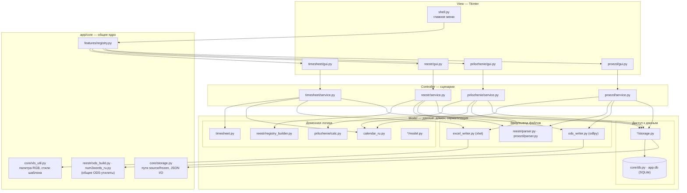
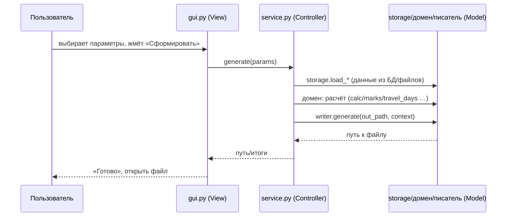
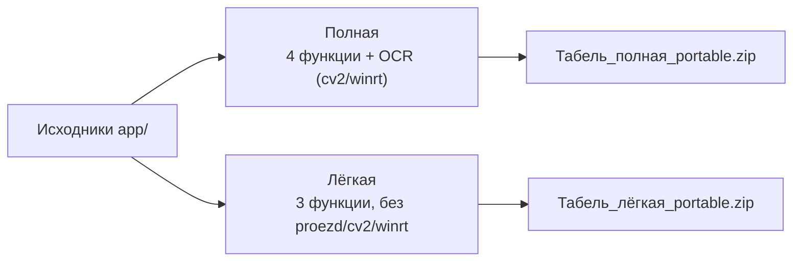

# Архитектура системы

Документ описывает целевую архитектуру приложения (Tkinter, генерация офисных
документов без Excel) по принципам **MVC** и **SOLID**. Это **опорный документ**: при
добавлении нового функционала сначала смотрим сюда, встраиваемся в слои и **дополняем
этот файл** (правило проекта — см. [CLAUDE.md](../../CLAUDE.md) и `docs/ОБЗОР.md`).

Сопутствующие документы: [ОБЗОР.md](ОБЗОР.md) (что делает приложение),
[БАЗА_ДАННЫХ.md](БАЗА_ДАННЫХ.md) (схема БД), `docs/функции/*.md` (по одной функции).

---

## 1. Принципы

### MVC (как он ложится на код)

| Слой | Роль | Где живёт |
|---|---|---|
| **Model** | Данные и доменная логика: чтение/запись БД и файлов, расчёты, сериализация документов. Не знает о Tkinter. | `app/core/db.py`, `app/features/<f>/storage.py`, `model.py`, расчётные модули (`calc.py`, `timesheet.py`, `calendar_ru.py`), писатели (`excel_writer.py` / `ods_writer.py`), парсеры (`parser.py`). |
| **Controller** | Оркестрация одного сценария: собрать вход из Model → посчитать → отдать во View/писатель. Без виджетов. Чистые функции/классы, тестируемые self-тестами. | `app/features/<f>/service.py`. |
| **View** | Окна и виджеты Tkinter: ввод пользователя, отображение, вызовы контроллера. **Тонкий слой**: без бизнес-правил и без прямых SQL/файловых операций. | `app/features/<f>/gui.py`, `app/shell.py`. |

**Правило зависимостей (однонаправленно):** `View → Controller → Model`. Model **не**
импортирует View/Controller; View **не** обращается к БД/файлам в обход Controller/Model.

### SOLID (как применяем)

- **S — Single Responsibility.** Один модуль — одна причина меняться: `storage` (доступ к
  данным), `service` (сценарий), `gui` (представление), писатель (сериализация формата),
  `parser` (чтение входных файлов), `calc`/доменные модули (правила).
- **O — Open/Closed.** Расширение — добавлением: новая функция = новый пакет + одна строка
  `Feature(...)`; новый формат документа = новый писатель. Реестр функций (`registry.py`)
  регистрирует фичи «мягко» (см. §5) — добавление/исключение фичи не требует правок ядра.
- **L — Liskov.** Все писатели взаимозаменяемы по контракту `generate(out_path, …) → путь`;
  все фичи — по контракту `open_<name>(master) -> tk.Toplevel`.
- **I — Interface Segregation.** Узкие контракты: `storage` каждой фичи отдаёт только нужное;
  `service` принимает простые данные (dict/dataclass), а не виджеты.
- **D — Dependency Inversion.** `service` зависит от абстракций Model (функции `storage`,
  доменные модели), а не от конкретики Tkinter; пути source/frozen скрыты за
  `core/storage.py` (`app_base_dir`/`feature_*`).

---

## 2. Карта системы (компоненты)

---

## 3. Подсистемы

### 3.1 Ядро (`app/core/`)
- **`db.py`** — единый источник правды (SQLite `app.db`): справочник, `pril_*`, `reestr_*`,
  календарь (`calendar_years` с `holidays`/`short_days`/`work_days`). Засев/миграция
  идемпотентны и под флагами в `meta`; миграция схемы — `_migrate_schema`. Подробно:
  [БАЗА_ДАННЫХ.md](БАЗА_ДАННЫХ.md).
- **`storage.py`** — работа из исходников и из `.exe`: `app_base_dir`, `feature_data_dir`,
  `feature_resource_dir`, `template_path`, `load_json`/`save_json` (атомарно, UTF-8).
- **`xls_util.py`** — `ColourPalette` (RGB→палитра `.xls`), `TemplateStyles` (перенос XF
  из шаблона в `xlwt`), `col_width`/`row_height`/`thin_borders`/`solid_fill`.
- **`version.py`** — `APP_VERSION`, `app_variant()` («Полная»/«Лёгкая») — для окна «Отзывы…».
- **`documents.py`** + **`documents_gui.py`** — **архив сформированных документов**: при
  формировании в любой функции файл копией сохраняется в БД (таблица `documents`: blob +
  params + метаданные); окно «Сохранённые документы» (открывается из главного меню) даёт
  открыть/сохранить как/удалить, **поиск по названию, фильтр по функции, сортировку по
  столбцам и колонку «Период»** (`params_brief` рендерит параметры). `save_file(feature, path,
  params)` вызывается из `gui._generate` каждой функции; `last_params(feature)` — параметры
  последнего отчёта функции (для автоподстановки). Выбор отделения запоминается между
  сеансами через `ui_state.set_last_dept`/`dept_index` (все функции с отделением).
- **`feedback.py`** — общий компонент **«Отзывы, жалобы и пожелания»**: диалог (категория,
  текст, авто-данные функция/версия/ОС/пользователь/дата). Кнопка «Отправить» шлёт письмо
  **прямо из приложения** через **Web3Forms** (`_post_web3forms`, `WEB3FORMS_KEY`) — HTTPS
  POST на `api.web3forms.com`, без своего сервера и без паролей в `.exe`. Нюанс: Web3Forms
  отвечает 403 на серверный запрос без браузерного `User-Agent` — он задаётся в заголовках.
  При отсутствии сети/ключа — запасной путь: почтовая программа (`mailto`) или «Скопировать».
  `add_button(...)` ставит кнопку в окно каждой функции.
- **`clipboard.py`** — `enable_cyrillic_clipboard(root)`: добавляет кириллические сочетания
  (`Ctrl+с/м/ч/ф` → `Cyrillic_es/em/che/ef`) к виртуальным событиям `<<Copy>>/<<Paste>>/
  `<<Cut>>/<<SelectAll>>`, иначе на русской раскладке копирование/вставка не работают
  (Tkinter ждёт латинские keysym). Вызывается один раз в `shell.py` — действует на все окна.
- **`version.py`** — единый источник версии: `tabel_app/VERSION` (один semver) читается из
  исходников; для one-file `.exe` `build.ps1` впечатывает значение в `_EMBEDDED_VERSION`.
  `APP_VERSION` (semver для сравнения), `APP_VERSION_DISPLAY` (с датой, для окна «Отзывы…»).
- **`updater.py`** + **`updater_gui.py`** — **авто-обновление**: читает манифест `version.json`
  из публичной папки Яндекс.Диска (адаптер без токена), сравнивает версии (`parse_version`/
  `is_newer`), скачивает установщик (потоково, проверка `sha256`, только https) и запускает его —
  Inno обновляет поверх через `AppMutex`. `installation_kind()` различает installed/portable/
  source (для portable установщик только скачивается, не ставится поверх). Только stdlib
  (urllib/ssl/hashlib/winreg). UI: тихая проверка при старте (в потоке, UI через `after`) +
  кнопка «Проверить обновления» в `shell.py`. Релиз: `build.ps1` штампует версию + `tools/
  make_manifest.ps1` генерирует `version.json` (sha256 установщиков) для выкладки на Яндекс.Диск.
- **`logging_setup.py`** — `setup()`: лог ошибок в `data/logs/app.log` (ротация) + перехват
  `sys.excepthook`; окна Tkinter шлют ошибки колбэков сюда (`shell.report_callback_exception`).
- **`ui_state.py`** — мелкое состояние интерфейса между сеансами (`data/_app/ui_state.json`):
  пропущенная версия обновления, последние папки сохранения и т.п.
- В **`db.py`**: `backup_db()` (резервная копия `app.db` → `data/backups/` с ротацией, перед
  миграцией, вызывается из `ensure_seeded`) и `export_db`/`import_db` (перенос всей базы одним
  файлом между ПК; импорт делает бэкап и проверяет, что это база «Табеля»). Кнопка «Перенос
  данных» в `shell.py`.

### 3.2 Лаунчер и реестр (`app/shell.py`, `app/features/registry.py`)
- `shell.py` — рисует карточку на каждую зарегистрированную фичу; панель сверху: «Справочники»,
  «Сохранённые документы», «Проверить обновления».
- `registry.py` — список `Feature(key, title, description, opener)`; **мягкая** регистрация
  (см. §5) для сборки версий с разным набором функций.
- `reference_gui.py` — окно **«Справочники»**: единая точка доступа к редакторам общих данных
  (Отделения и сотрудники, Производственный календарь, Реквизиты, Клиенты/группы) + экспорт/
  импорт всей базы. **Переиспользует** существующие редакторы из `features/*/gui.py`
  (`DepartmentManager`/`CalendarDialog`/`SettingsDialog`/`ClientsManager`), не дублируя логику.
  Живёт на уровне View (`app/`), а не в `core` — чтобы core не зависел от features.

### 3.3 Функции (`app/features/<name>/`)
Каждая — самодостаточный вертикальный срез (View/Controller/Model). Общие ODS-утилиты
(`reestr/ods_build.py`, `reestr/num2words_ru.py`) переиспользуются «Проездом» — это
сознательная зависимость на уровне Model.

| Функция | View | Controller | Model (домен / IO / store) |
|---|---|---|---|
| timesheet | `gui.py` | `service.py` | `timesheet.py`, `calendar_ru.py` / `excel_writer.py` / `storage.py` |
| reestr | `gui.py` | `service.py` | `registry_builder.py`, `model.py` / `parser.py`, `journal.py` (отметки новый/пересмотр по ФИО), `ods_writer.py`, `ods_build.py`, `num2words_ru.py` / `storage.py` |
| reestr_oplata | `gui.py` (Treeview-чеклист: галочка = применить; новым — соцработник комбобоксом) | `service.py` (план журнал→реестр по ФИО+№ договора: суммы/снятые/новые/доп; применение + пересборка формул) | `model.py` (строки-ссылки на odfpy-элементы), `ods_editor.py` (разбор готового .ods, правка строк, **пересборка живых формул** Итого/Всего/деньги/Доп + письма), `reestr/journal.py` `parse_journal_detailed` (журнал с суммами), `reestr/ods_build.py`, `reestr/num2words_ru.py` |
| prilozhenie | `gui.py` | `service.py` | `calc.py`, `model.py` / `excel_writer.py` / `storage.py` |
| proezd | `gui.py` | `service.py` | `model.py` (формы/контекст), `calendar_ru` / `parser.py`, `ods_writer.py` / `storage.py` (+ JSON) |
| uslugi_dengi | `gui.py` | `service.py` | `model.py` (канон услуг) / `parser.py` (xlrd+openpyxl), `writer.py` (openpyxl, шаблон с формулами) / `storage.py` |
| grafiki | `gui.py` | `service.py` (ротация) | `writer.py` (openpyxl, с нуля) / `storage.py` (соцработники из БД) |
| gos_zadanie | `gui.py` | `service.py` (категоризация услуг) | `model.py` (нормализация + справочник), `parser.py` (xlrd) / `writer.py` (odfpy, .ods с нуля) / `storage.py` (services_seed.json + соцработники из БД) |
| proverka_kachestva | `gui.py` (Treeview с инлайн-правкой) | `service.py` (четверги месяца, разбор реестра) | `reestr/parser.py` (переиспользование, xlrd) / `writer.py` (odfpy, .ods с нуля, landscape) / `storage.py` (телефоны клиентов в БД `pk_phones`) |
| peresmotr | `gui.py` (Treeview) | `service.py` (окончание срока ИПСУ за месяц) | `reestr/parser.py` (parse_ipsu, переиспользование) / `writer.py` (odfpy, .ods с нуля) |

---

## 4. Поток данных одной функции (пример)

---

## 5. Расширение: как добавить функцию

1. Создать пакет `app/features/<name>/` с `__init__.py` (`FEATURE_KEY/TITLE/DESCRIPTION`),
   `gui.py` (`open_<name>(master)->Toplevel`, тонкий View), `service.py` (Controller),
   `storage.py` + доменные/IO-модули (Model).
2. Зарегистрировать **одной строкой** в `registry.py` (мягко: импорт в `try/except`, чтобы
   отсутствие фичи в «лёгкой» сборке не ломало приложение — см. §6).
3. Добавить `--add-data` в `build.ps1` для ресурсов фичи (`features/<name>/...`).
4. Хранить данные в общей БД через `core/db.py` (или per-feature JSON для мелкого состояния).
5. Соблюдать слои (View→Controller→Model) и **дополнить документацию**: `docs/функции/<name>.md`,
   при изменении схемы — `БАЗА_ДАННЫХ.md`, при изменении архитектуры — этот файл.

---

## 6. Сборка: версии «Полная» и «Лёгкая»

Две поставки из одного кода (Open/Closed): различие — только набор включённых функций и
бандл тяжёлых зависимостей.

- **Мягкая регистрация:** `registry.py` пытается импортировать каждую фичу в `try/except
  Exception`; не импортируемая (исключённая из сборки) — пропускается. Так «лёгкая» сборка
  без `proezd`/`cv2`/`winrt` работает без правок ядра.
- **Полная:** `build.ps1` со всеми `--add-data` (вкл. proezd) и сбором OCR-зависимостей.
- **Лёгкая:** без `--add-data` proezd и с `--exclude-module proezd`/`cv2`/`winrt` —
  существенно меньше и быстрее.
- **Поставка:** два формата на каждую версию —
  - **portable** `.zip` (папка `Табель.exe` + `data/` + `Инструкция.txt`) в корневой `Сборки/`;
  - **установщик** (Inno Setup) в корневой `Установщики/` — ставит в `%LOCALAPPDATA%\Tabel`
    (полная) / `…\Tabel-lite` (лёгкая) **без прав администратора**, ярлыки на рабочем столе
    и в меню Пуск, деинсталлятор; `data\*` ставится с `onlyifdoesntexist` (не затирает БД при
    обновлении). **Повторный запуск ОБНОВЛЯЕТ установку поверх (не вторая копия):** фикс.
    `AppId` + `UsePreviousAppDir=yes` + `DisableDirPage=yes` + `CloseApplications=yes`; приложение
    создаёт мьютекс `TabelAppRunningMutex` (`main._create_app_mutex`), его ловит `AppMutex`
    установщика (предложить закрыть программу перед обновлением). Скрипты —
    `tabel_app/installer/{full,lite}.iss` (UTF-8 **с BOM** — иначе Inno портит кириллицу; в
    `.iss` ASCII-`Source` + кириллический `DestName`). Компилятор — `ISCC.exe` (Inno Setup 6, winget).

---

## 7. Инварианты, которые нельзя нарушать

- **Вывод файлов сверен по ячейкам** — рефакторинг не должен менять генерируемые документы;
  после изменений гонять self-тесты (`--selftest*`) и сверять с эталонами.
- **Без Microsoft Office** — только `xlwt`/`odfpy`/`xlrd`/`openpyxl` (`.xls`/`.ods`/`.xlsx`/`.odt`).
- **Сохранение `employee.id`** при синхронизации состава (иначе осиротеют `pril_*`).
- **Идемпотентность засева/миграции** (`meta`-флаги, `_migrate_schema`).
- **View — тонкий**: бизнес-логику держим в Controller/Model.
