# База данных приложения

Единая база **SQLite** обслуживает все четыре функции приложения. Это единственный
источник правды (single source of truth): состав отделений, сотрудники, реквизиты,
производственный календарь, а также рабочие таблицы функций «Приложение к табелю» и
«Реестр» — всё лежит в одном файле и видно из любой функции.

- **Файл:** `<рядом с программой>/data/app.db`
  (в собранном `.exe` — рядом с `Табель.exe`; при запуске из исходников — `tabel_app/data/app.db`)
- **Модуль:** `app/core/db.py` — схема, соединение, засев/миграция и тонкие помощники.
- **Режим:** включён `PRAGMA foreign_keys = ON` (внешние ключи действуют, каскады работают).

Каждая функция обращается к базе через свою тонкую обёртку `storage.py`; данными она
**не владеет** — владелец данных всегда `db.py`.

---

## ER-диаграмма

```mermaid
erDiagram
    departments ||--o{ employees : "dept_id (CASCADE)"

    employees ||--|| pril_load_default     : "employee_id (CASCADE)"
    employees ||--o{ pril_period           : "employee_id (CASCADE)"
    employees ||--o{ pril_absence          : "employee_id (CASCADE)"
    employees ||--o{ pril_redistribution   : "from/to_employee_id (CASCADE)"
    employees |o--o| reestr_workers         : "employee_id (SET NULL)"

    reestr_workers ||..o{ reestr_clients   : "по ФИО (worker_fio, без FK)"

    departments {
        int  id PK
        text ext_id          "внешний id отделения из JSON"
        text name
        text organization
        text responsible_fio
        text responsible_position
        int  sort_order
    }

    employees {
        int  id PK
        int  dept_id FK "→ departments.id, ON DELETE CASCADE"
        int  n          "порядковый номер в отделении"
        text fio
        text tab_number "табельный номер"
        real oklad
        text position
        int  sort_order
    }

    settings_kv {
        text key PK
        text value "JSON"
    }

    calendar_years {
        int  year PK
        text holidays   "JSON-массив дат (MM-DD)"
        text short_days "JSON-массив сокращённых дней"
        text work_days  "JSON-массив перенесённых РАБОЧИХ дней (рабочая сб/среда)"
    }

    pril_load_default {
        int  employee_id PK "→ employees.id, ON DELETE CASCADE"
        real load_gor      "стандарт чел/день — город"
        real load_chast    "стандарт чел/день — частный сектор"
        real norma_gor     "норма город (по умолч. 10)"
        real norma_chast   "норма частный (по умолч. 8)"
        int  active        "1 — участвует в приложении"
    }

    pril_period {
        int  id PK
        int  employee_id FK "→ employees.id, CASCADE"
        int  year
        int  month
        text sector   "'gor' | 'chast'"
        int  day_from
        int  day_to
        real value
    }

    pril_absence {
        int  id PK
        int  employee_id FK "→ employees.id, CASCADE"
        int  year
        int  month
        int  day_from
        int  day_to
        text code "код отсутствия (из Табеля)"
    }

    pril_redistribution {
        int  id PK
        int  year
        int  month
        text sector
        int  from_employee_id FK "→ employees.id, CASCADE"
        int  to_employee_id   FK "→ employees.id, CASCADE"
        int  day_from
        int  day_to
        real value
    }

    reestr_workers {
        int  id PK
        text fio "UNIQUE"
        int  employee_id FK "→ employees.id, ON DELETE SET NULL"
        int  sort_order
    }

    reestr_clients {
        int  id PK
        text fio "UNIQUE"
        text worker_fio "ФИО соцработника (логическая связь)"
        int  sort_order
    }

    reestr_kv {
        text key PK
        text value "JSON (напр. prev_month)"
    }

    pk_phones {
        text client_fio PK "ФИО клиента (нормализовано по пробелам)"
        text phone "телефон для «Проверки качества»"
    }

    plany_workers {
        text dept PK "отделение (напр. 5, 9)"
        int year PK "год"
        int month PK "месяц (1-12)"
        text worker "соцработник «Заслушивания» (иначе из шаблона)"
    }

    meta {
        text key PK
        text value "флаги засева: seeded / ts_migrated / reestr_seeded"
    }

    documents {
        int  id PK
        text feature "ключ функции"
        text title
        text filename
        text created_at
        text params "JSON параметров"
        blob content "копия файла"
    }
```

> **Логическая связь vs FK.** `reestr_clients.worker_fio` ссылается на `reestr_workers.fio`
> **строкой по ФИО**, а не внешним ключом, — поэтому на диаграмме связь пунктиром.
> `reestr_workers.employee_id` — настоящий FK на `employees`, но с `ON DELETE SET NULL`
> (соцработник реестра переживает удаление сотрудника, просто теряет привязку).

---

## Группы таблиц

### Общий справочник (используют все функции)

| Таблица | Назначение |
|---|---|
| `departments` | Отделения: название, организация, ответственный (ФИО + должность), порядок. |
| `employees`   | Сотрудники отделения: ФИО, табельный номер, оклад, должность. `dept_id` → `departments` с **ON DELETE CASCADE**. |
| `settings_kv` | Произвольные настройки приложения «ключ → значение» (значение хранится как JSON). |
| `calendar_years` | Производственный календарь по годам: `holidays` (праздники/перенесённые нерабочие), `short_days` (сокращённые), `work_days` (перенесённые **рабочие** дни — рабочая суббота/среда). Все — JSON-массивы `MM-DD`. Колонка `work_days` добавляется на старых базах безопасной миграцией `ALTER TABLE` в `_migrate_schema` (`db.py`). |
| `meta`        | Служебные флаги идемпотентного засева/миграции. |
| `documents`   | Архив всех сформированных файлов (копия `content` + `params` JSON + метаданные). Заполняется при формировании в любой функции; просматривается в окне «Сохранённые документы» (`core/documents.py`, `core/documents_gui.py`). FK нет. |

### Функция «Приложение к табелю» (`pril_*`)

| Таблица | Назначение |
|---|---|
| `pril_load_default` | Постоянная (не зависящая от месяца) нагрузка соцработника: стандарт чел/день по городу и частному сектору + нормы. Один-к-одному с `employees` (`employee_id` = PK = FK CASCADE). |
| `pril_period`       | Помесячные переопределения нагрузки блоками дат (`day_from..day_to`) по сектору. Если на (сотрудник, год, месяц, сектор) есть строки — они задают значения по дням; иначе берётся постоянная нагрузка. |
| `pril_absence`      | Отсутствия сотрудника (импортируются из Табеля, правятся вручную): диапазон дней + код. |
| `pril_redistribution` | Ручное перераспределение чел/дней: на дни `day_from..day_to` по сектору передать `value` чел/день от `from_employee_id` к `to_employee_id`. |

Все четыре таблицы привязаны к `employees` через **ON DELETE CASCADE** — удаление
сотрудника автоматически уносит его строки приложения. Именно поэтому при синхронизации
состава (см. ниже) id сотрудников **сохраняются**.

### Функция «Реестр» (`reestr_*`)

| Таблица | Назначение |
|---|---|
| `reestr_workers` | Соцработники-группы реестра и порядок их вывода. `fio` UNIQUE; `employee_id` — мягкая привязка к `employees` (SET NULL). |
| `reestr_clients` | Клиенты и закреплённый за каждым соцработник (`worker_fio` — по ФИО). `fio` UNIQUE. |
| `reestr_kv`      | Служебные JSON-блобы реестра (например, `prev_month` — данные прошлого месяца для листа «пересмотр»). |
| `pk_phones`      | Телефоны клиентов для «Проверки качества» (в реестре их нет): ключ — ФИО, значение — телефон; вводятся вручную и запоминаются. |
| `plany_workers`  | Соцработник «Заслушивания» для функции «Планы»: ключ — (отделение, год, месяц); пусто → берётся из шаблона плана. |

---

## Засев и миграция (`ensure_seeded`)

`ensure_seeded()` (`db.py:183`) выполняется **один раз за процесс** и состоит из
независимых идемпотентных шагов, каждый под своим флагом в таблице `meta`:

| Флаг (`meta.key`) | Шаг | Когда срабатывает |
|---|---|---|
| `seeded` | Первичный засев справочников из JSON Табеля (`_seed_departments_employees`, `_seed_settings`, `_seed_calendar`, `_seed_pril_loads`). | Только на **чистой** базе. |
| `ts_migrated` | Однократный перенос правок состава/настроек/календаря, сделанных в JSON после засева, в базу (`_migrate_timesheet_from_json`). | На существующей базе, если флаг ещё не стоит. На свежей базе ставится сразу (данные уже из актуального JSON). |
| `reestr_seeded` | Однократная загрузка клиентов/групп реестра (`_seed_reestr`): пользовательский `worker_map.json` → иначе зашитый `grouping_seed.json`; `prev_month.json` → в `reestr_kv`. | Один раз. |

### Почему важно сохранять id сотрудников

`replace_departments` (`db.py:384`) / `_replace_employees` (`db.py:437`) приводят таблицы
к переданному составу, но **не пересоздают строки вслепую**:

- сотрудник опознаётся по `_db_id`;
- при `match_by_fio=True` (перенос из JSON, где `_db_id` нет) — сначала по **табельному
  номеру**, затем по **ФИО**;
- существующие строки обновляются (id остаётся), отсутствующие удаляются, новые вставляются.

Это сохраняет `employees.id`, а значит и привязанные к нему данные `pril_*`
(они каскадно удалились бы при пересоздании сотрудника). **Эту логику нельзя ломать**
при изменении синхронизации состава.

### JSON — только значения по умолчанию

Файлы `app/features/<feature>/data/*.json` — это **seed-значения по умолчанию**, а не
рабочее хранилище. После первого запуска живые данные лежат в `app.db`. Правка JSON на
уже работающей установке не вступит в силу (кроме однократной миграции по флагу).

Сидируемые JSON:
- `timesheet/data/departments.json` — отделения и сотрудники;
- `timesheet/data/settings.json` — настройки/реквизиты;
- `timesheet/data/calendar.json` — производственный календарь;
- `prilozhenie/data/loads_seed.json` — постоянная нагрузка соцработников (сверка по ФИО);
- `reestr/data/grouping_seed.json` — группировка клиентов по соцработникам.

---

## Публичный API (`db.py`)

Функции верхнего уровня сами вызывают `ensure_seeded()` и открывают своё соединение —
обёртки `storage.py` каждой функции опираются именно на них:

| Функция | Назначение |
|---|---|
| `departments_load()` / `departments_save(data)` | Чтение/запись состава (формат словаря с `_db_id`). |
| `settings_load()` / `settings_save(data)` | Настройки/реквизиты. |
| `calendar_load()` / `calendar_save(data)` | Производственный календарь. |
| `reestr_map_load()` / `reestr_map_save(obj)` | Группировка реестра (`worker_order` + `client_worker`). |
| `reestr_kv_load(key, default)` / `reestr_kv_save(key, obj)` | Служебные блобы реестра. |
| `employee_worker_fios()` | ФИО сотрудников-«соцработников» (по должности) для списков выбора. |
| `pk_phone_load(fio)` / `pk_phone_save(fio, phone)` / `pk_phones_load_all()` / `pk_phone_delete(fio)` | Телефоны клиентов «Проверки качества» (таблица `pk_phones`). |
| `plany_worker_load(dept, year, month)` / `plany_worker_save(...)` / `plany_workers_load_all(dept, year)` | Соцработник «Заслушивания» функции «Планы» (таблица `plany_workers`). |
